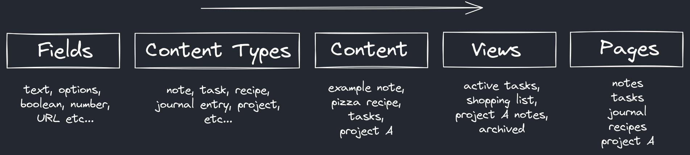

# Athena
A local-first web app for creating customizable content databases, suitable for note-taking, task-management, personal knowledge bases and more.

---

**This project is very early in development and is not complete or stable.**  
The about section below outlines the aspirational goal of this apps functionality, but is not currently the reality.  
Keep an eye on the releases and commits to see the current progress!

More documentation including usage instructions, development setup, more details will come closer to a `v1.0` release.

---

## About
The way each person wants to organise their content (such as notes, tasks etc) is unique, personal and often use-case specific.  
Athena gives you the building blocks to create your own content databases, in your own way. It is not just a "notes app"
or a "task management app", it is what you decide to build.  

### Content Structure

You build your own content structure using "fields", "content types", "views" and "pages".  
The diagram below gives a rough example of how this could work, and for more details visit the **[content structure guide](./docs/content-structure.md)**.

### Cloud Features
Athena is a local-first progressive web app, meaning it's designed to work on your device, and doesn't need an internet connection!  
If you wish to enable features like cloud storage and cross device synchronisation, you can do this by self-hosting your own [Localful](https://github.com/ben-ryder/localful) server.

## Project Structure
This is a monorepo containing all projects related to Athena:
- `web` - The web app for using Athena in a browser.
- `design` - Contains designs, wireframes etc

## Contributions
This project is open source, not open contribution.  
This is a personal project currently so while your more than welcome to try it out and raise bug reports and similar
I'm not interested in external code contributions or feature requests right now.

## License
All projects that are part of Athena are released under the [GNU AGPLv3](https://choosealicense.com/licenses/agpl-3.0/) license.
